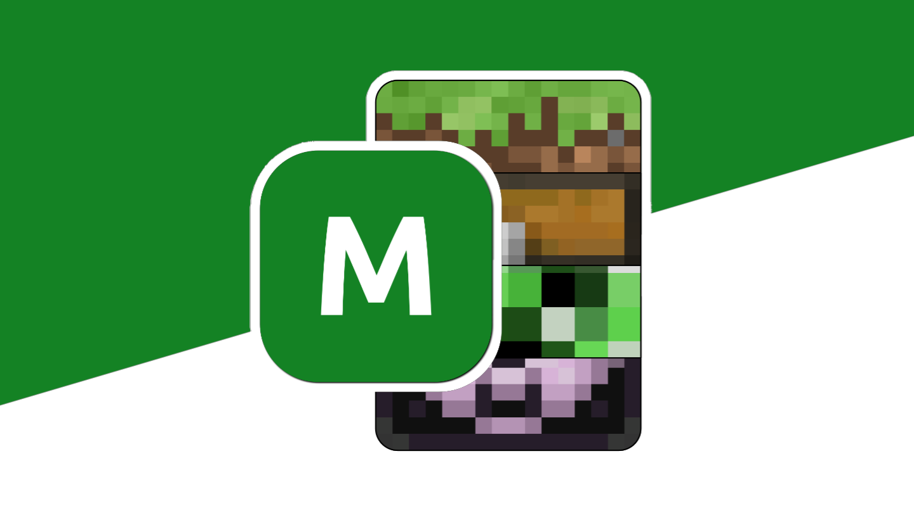

# Средства для моддинга

[](https://icmods.mineprogramming.org/mod?id=614)
[](https://vk.com/nteditor)
[](http://www.apache.org/licenses/LICENSE-2.0.html)



## Вступление

Мы создали его для Вас, таких же разработчиков как и мы. *Создавать контент прямо в игре — основная задача данной связи API.* Кнопка меню откроет обширные возможности визуальной части модификации, специальные средства для разработчиков и модельеров.

На данный момент имеются следующие возможности:
- Моделирование статичных моделей `ICRender`
- Создание специальных переходов `Transition`
- Моделирование объектных моделей `Render`
- Редактирование и проектирование окружения
- Встроенная в модификацию система модулей
- Разрабатываемые новые возможности

## От разработчиков разработчикам

Если у Вас есть предложения/пожелания и/или ошибки во время работы нашей среды, Вы можете рассказать об этом на нашей доске в [Trello](https://trello.com/b/wzYtpA3W/dev-editor). Нам будет крайне интересно изучить Вашу проблему или предложение, чтобы исправить или добавить их в ближайшее время.

Принять участие в разработке мода можно прямо сейчас: исходный код опубликован здесь, каждый может вносить любого рода правки благодаря технологиям `GitHub`. По любым вопросам обращайтесь в [нашу группу](https://vk.me/nernar). Актуальную версию всегда можно найти в ней.

## Использование

Для начала достаточно зайти в любой мир. В верхней левой части экрана (может отличаться в зависимости от версии) появится всего *одна кнопка* — ее достаточно, чтобы открыть обширные возможности мода. Для примера создадим с нуля рендер, просто добавьте в свой проект (модификацию или скрипт) блок с рендером. Немного откроем в себе дизайнера, создадим текстуры и смоделируем что-то новое.

Также Вы можете и добавить существующий рендер в свой проект, просто откройте любой скрипт своей модификации через импорт. Для примера можно создать файл в папке `Modding Tools` в формате *.js* и использовать следующий код, который добавит тумбочку:

```js
let render = new ICRender.Model(); 
BlockRenderer.setStaticICRender(1, 0, render); 
let model = BlockRenderer.createModel(); 

model.addBox(0/16, 0/16, 0/16, 1/16, 16/16, 16/16, "wood", 0);
model.addBox(31/16, 0/16, 0/16, 32/16, 16/16, 16/16, "wood", 0);
model.addBox(1/16, 0/16, 0/16, 16/16, 16/16, 1/16, "wood", 0);
model.addBox(16/16, 0/16, 0/16, 31/16, 16/16, 1/16, "wood", 0);
model.addBox(1/16, 1/16, 1/16, 16/16, 2/16, 16/16, "wood", 0);
model.addBox(16/16, 1/16, 1/16, 31/16, 2/16, 16/16, "wood", 0);
model.addBox(1/16, 8/16, 1/16, 16/16, 9/16, 16/16, "wood", 0);
model.addBox(16/16, 8/16, 1/16, 31/16, 9/16, 16/16, "wood", 0);
model.addBox(1/16, 15/16, 1/16, 16/16, 16/16, 16/16, "wood", 0);
model.addBox(16/16, 15/16, 1/16, 31/16, 16/16, 16/16, "wood", 0);
model.addBox(5/16, 9/16, 10/16, 14/16, 11/16, 15/16, "stone", 0);

render.addEntry(model);
```

> Перед использованием этой модели в игре, замените идентификатор (1) установки рендера на свой!

## Информация

Меню открывает перед собой основные доступные пункты. *Вы можете напрямую импортировать часть кода, а модификация сама распознает поддерживаемые части проекта.* При этом, произойдет конвертирование скрипта в один проект — это позволит хранить информацию более удобно.

Стандартная папка для экспорта находится в папке `Modding Tools/projects`. Сюда сохраняются все проекты и отсюда же они загружаются, эта папка меняется в файловом проводнике игры.

Интерфейс разделяется по типам — существуют окна координат, выделения элементов, деревьев проекта и прочие. Доступ к моделированию доступен *только в мире*, так как многие возможности доступны только изнутри.

Для использования многих инструментов, необходимо базовое понятие [оси координат](https://ru.wikipedia.org/wiki/%D0%A1%D0%B8%D1%81%D1%82%D0%B5%D0%BC%D0%B0_%D0%BA%D0%BE%D0%BE%D1%80%D0%B4%D0%B8%D0%BD%D0%B0%D1%82). Координаты формируют реальное расположение элемента в мире, поворот элементов выражается в градусах по выбору разработчика.

---

**Желаем Вам приятного моделирования!**
